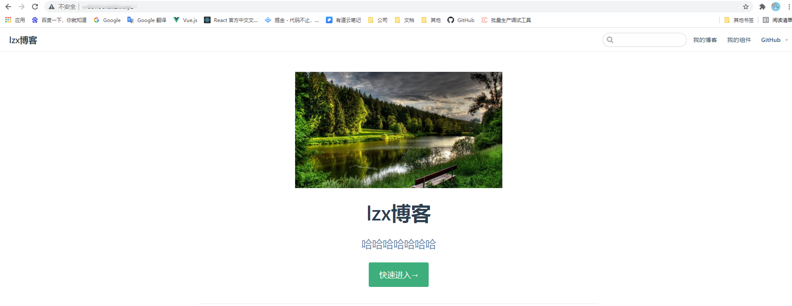
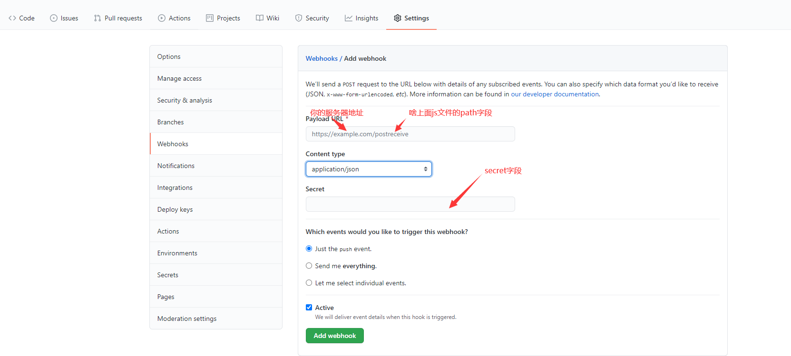
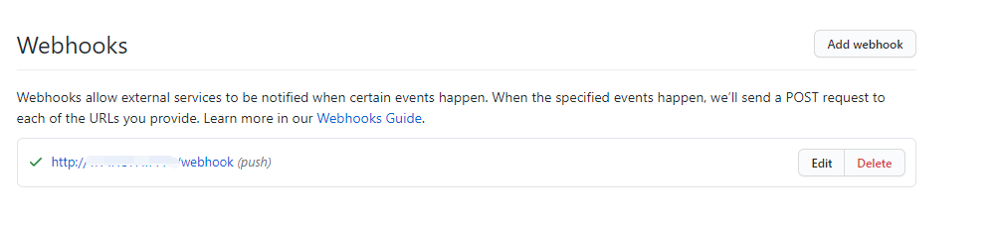
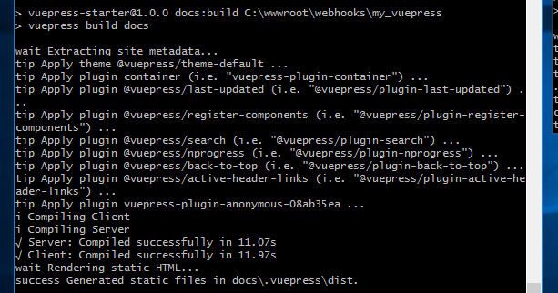

<!--
 * @Description: 
 * @Author: lzx
 * @Date: 2021-07-26 17:37:59
-->
# github自动部署项目到windows服务器（使用宝塔面板）
----
## 说明

通过简单的配置，实现项目自动部署，只需把项目代码推送到github默认分支。

### 1.项目搭建，宝塔配置建站

准备好你的项目，上传到github上面，再把项目上传到你的服务器，使用宝塔建站（过程省略），网站目录是打包完后dist目录，搭建完成后保证能正常访问。



### 2.编写自动化脚本，当分支有push事件时触发脚本

当我们把代码push到主分支时，我们要做的事情有这几个

> * 1.项目拉取github最新的代码
> * 2.安装依赖(防止依赖包更新)
> * 3.打包项目

所以在根目录下新建autobuild.sh脚本，内容为我们需要运行的几个命令
```js
git pull origin master      # 拉取最新分支的代码
npm install                 # 安装依赖
npm run build               # 你打包的命令
```
也在根目录下新建autobuild.js文件，监听push时间，当代码提交时就触发该文件，进行上面的脚本操作
```js
const http = require('http')
const createHandler = require('github-webhook-handler')
const handler = createHandler({ path: '/webhook', secret: 'myhashsecret' })

http.createServer(function (req, res) {
  handler(req, res, function (err) {
    res.statusCode = 404
    res.end('no such location')
  })
}).listen(7777)
 
handler.on('error', function (err) {
  console.error('Error:', err.message)
})
 
handler.on('push', function (event) {
  console.log('Received a push event for %s to %s',
    event.payload.repository.name,
    event.payload.ref)
    run_cmd('sh', ['./autoBuild.sh'], function(text){ console.log(text) }); // 执行autoBuild.sh
})

// 新增run_cmd函数
function run_cmd(cmd, args, callback) {
    var spawn = require('child_process').spawn;
    var child = spawn(cmd, args);
    var resp = "";

    child.stdout.on('data', function(buffer) { resp += buffer.toString(); });
    child.stdout.on('end', function() { callback (resp) });
}
```
随后node autobuild.js运行文件（可以用pm2运行防止服务终止）

### 3.github webhooks配置



当有绿色的打钩即表示push后触发了自动化脚本，可以在服务器上看到运行的情况


跑完重新刷新页面即可


